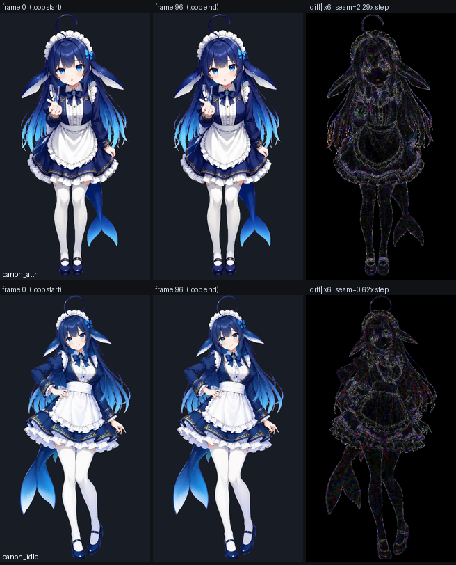
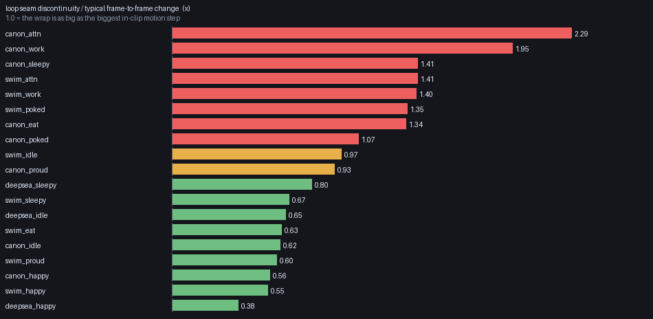
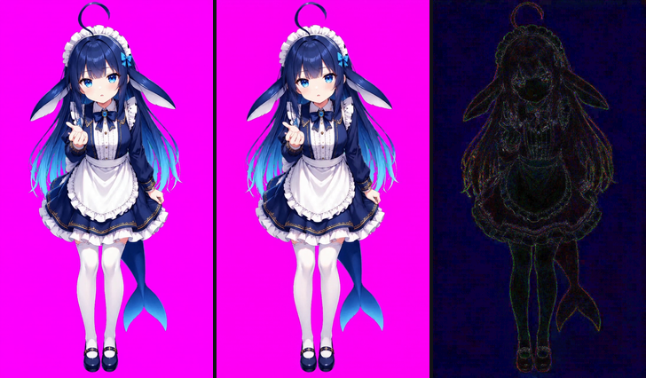

# 帧动画研究（2026-10-08 / 09）

> 这一轮的产物。**没有改仓库里的任何文件** —— 只读测量 + 一个建议清单。
> 所有数字都是**重新量出来的**（Pillow 解码 19 条素材的每一帧 + 读容器字节），
> 不是抄注释。探针留在 `%TEMP%\wisp-motion\`（probe3 / control / wrap / steps / strip / dispose）。
>
> 测量口径（后面每张表都用它）：
> * `mean_step` = 相邻两帧 `|ΔRGB|` 全画布均值的平均（"这一条素材平时一帧动多少"）
> * `seam` = 第 96 帧 → 第 0 帧的同一种差 `seam_x = seam / mean_step`
>   （1.0 = 接头和这条素材里最大的一次帧间变化一样大）
> * **合成口径**：`displayed = rgb*(a/255) + bg*(1-a/255)`，在 **472×840**（她真正被画出来的尺寸）
>   上数"最大通道差 > 8"的像素占比。**透明像素下面的 RGB 不算** —— 编码器有权改它，
>   改了也看不见（第一版量法就栽在这里，q 越低"RGB PSNR"越差，其实是量错了东西）。

---

## 0. 七条结论

1. **容器契约一条没漂**：19 条全是 720×1280 / 97 帧 / 41,42ms 交替 / 合计 4041ms / `loop 0` / 带 alpha。
   而且 **97 帧里没有一帧是重复的**（`dup_exact = 0`、`dup_tiny = 0`，19/19）——"一帧不抽"是真的。
2. **环缝有 6 条肉眼可见**：`canon_attn` 的接头是 **2.29×** 它自己平均帧间步长，`canon_work` 1.95×。
   设计意图（首帧=尾帧 ⇒ 无缝）**只对一半素材成立**。
3. **接头不是位移、不是 WebP 背景清除伪影** —— 两条假设都做了实验，都被数据否掉了。
   它是**画面内部的明暗/细节漂移**：轮廓（alpha）几乎原样回来，画上去的东西没回来。
4. **两条能白捡**：`canon_work` / `swim_work` 的**最后一帧是离群帧**，砍掉它接头从
   1.95× → 1.01×、1.40× → 0.46×。代价是 97 帧变 96 帧，**正好撞在预检那条"帧数不许动"的硬闸上**。
5. **体积的地板是 alpha，不是画质**：60.34 MB 里 **16.26 MB（27.0%）是无损 alpha 平面**，
   它 **完全不随 `-q:v` 变**（q40→q15 画质部分掉 25%，alpha 一个字节没少）。
   当前 ffmpeg 的 `libwebp_anim` **没有暴露 `alpha_quality`**，所以这条地板在现在的流水线上撬不动。
6. **能压的只有 6~9%**：alpha 量化到 16 级（最大误差 8/255、0 个像素越过 8 级线、合成画面变化
   0.90% —— 比"同参数重编码"自身的噪声 2.77% 还小）省 **6.1%**；到 8 级省 8.5%。
   再往下（4 级 11.8%、2 级 17.9%）就开始进入看得见的区间。
7. **分辨率不能降**（与 1.46.3 那个决定一致，且现在有算术支撑）：她在 `size 4` 下被画成
   **472×840 CSS px**，DPR 2 需要 944 设备像素 —— 720 已经只有它的 **0.76×**，是**放大**显示；
   同一格里静态立绘是 1024 源像素对 1120 设备像素（0.91×）。动图这一层**永远比它替换掉的立绘软**。

---

## 1. 硬事实（19 条，全部重新量过）

| 项 | 值 |
|---|---|
| 素材条数 | **19**（canon 8 / swim 8 / deepsea 3） |
| 画布 / 帧数 / 帧时长 | 720×1280 / 97 / 41ms 与 42ms 交替，合计 **4041ms** |
| 循环 | `ANIM.loop = 0`（无限） |
| alpha | 19/19 带 alpha 平面；每帧半透明像素 **2520 px（0.27%）**，中位 alpha **129**、均值 128 |
| 磁盘 | **61,785.5 KB = 60.34 MB**；单条 2.56~3.84 MB |
| 包体 | **103.17 MB**（帧动画占 **58.5%**；精灵图 18.20 MB → client.js 24.58 MB） |
| 平均码率 | 60.34 MB × 8 / (19 × 4.041s) ≈ **6.3 Mbps** |
| 不透明占比 | 27.5%~36.4%（门槛 15%，全部通过） |
| 她在素材里占的高度 | canon 0.981~0.989 · swim 0.9445~0.9906 · deepsea 0.9734~0.9898 |

**alpha 平面的真实形状**（这决定了它的编码代价）：
`alpha=0` 约 65%、`alpha=255` 约 34.7%、**0<alpha<255 只有 0.27% 且集中在 ~129**。
也就是说它几乎是二值的，只有一圈**一像素宽的 50% 过渡带**。
它之所以贵，是**边界周长**贵（发丝、裙子褶皱的周长极长），不是灰阶多。

---

## 2. 环缝：设计意图只对一半素材成立

上图：`canon_attn`（最差）与 `canon_idle`（最好）。左=第 0 帧，中=第 96 帧，右=两者之差 ×6。

| 素材 | seam / mean_step | 接头 vs 本条最大帧间步长 |
|---|---|---|
| `canon_attn` | **2.29** | 1.08 |
| `canon_work` | **1.95** | 0.99 |
| `canon_sleepy` | 1.41 | 0.88 |
| `swim_attn` | 1.41 | 0.96 |
| `swim_work` | 1.40 | 0.83 |
| `swim_poked` / `canon_eat` / `canon_poked` | 1.35 / 1.34 / 1.07 | 0.63 / 0.93 / 0.75 |
| `canon_idle` / `swim_happy` / `deepsea_happy` | 0.62 / 0.55 / **0.38** | 0.57 / 0.57 / 0.85 |

### 2.1 两个"看起来对"的解释，都被实验否掉了

* **不是位移**：对每条素材暴力搜索 ±6px 的最佳整数平移，**19/19 都是 (0,0)，平移一分都不省**
  （gain ≈ 0%）。轮廓包围盒也逐帧吻合（差 ≤1px）。她是**原地**回来的。
* **不是 WebP 背景清除伪影**：`dispose=bg` 的帧后面接一个更小的矩形时，未被覆盖的条带
  一共 **2,400,000+ 像素，实测全是 alpha=0、纯白像素 0 个**。ANIM 的背景色虽然写着不透明白，
  解码器并不拿它去填 —— **CLEAN**。

所以差异是**画上去的内容**：同一个人、同一个姿势、同一副轮廓，明暗与细节没对齐。
这与"首尾同图锁身份"的预期不符 —— 生成服务拿到了同一张首尾图，仍然没有把最后一帧画回那张图。

### 2.2 两条白捡的，和一条救不回来的

| 素材 | 末 6 步（帧间变化 / 平均） | 接头在 96 | 若在 95 收尾 | 结论 |
|---|---|---|---|---|
| `canon_work` | 0.63 0.79 0.65 0.64 0.53 **1.97** | 1.95× | **1.01×** | 最后一帧是离群帧，砍掉即修好 |
| `swim_work` | 1.35 0.74 0.80 0.23 0.22 **1.35** | 1.40× | **0.46×** | 同上，改善 67% |
| `canon_attn` | 1.10 1.24 2.17 0.79 0.82 1.60 | 2.29× | 2.43× | **遍历全部 97 个切点**，最好的接头仍是 **1.00×** —— 这条素材**从来没有回到过起点**，只能重做 |

代价说清楚：砍一帧 = 97→96 帧、4.041→4.000s。
**预检里 `frames !== 97` 是一条硬断言**（v1.46.4 立的那条"帧预算不许动"），现在它同时挡住了
"为了省体积抽帧"和"为了环缝丢一个离群帧"这两件完全不同的事。要拿这条收益，得先把那道闸
改成"97 帧，**除非**丢掉的是环缝离群帧且记录了环缝指标"。

---

## 3. 尺寸校正：`MOTION_FIT = {}` 仍然成立

用与 README 同一把尺子（alpha > 127 的不透明包围盒高 / 画布高）逐对量 19 个
`皮肤:状态 → 素材` 组合：

**19/19 全部 ≤ 2%，最差 `swim_proud` 1.70%**（素材 0.9504 vs 立绘 0.9668）。
`MOTION_FIT` 是空表、样式表里三条"显式不校正"——**这一版的决定是对的**，可以继续钉着。

---

## 4. 体积：地板在哪、杠杆有多长

### 4.1 先说结论：`-q:v` 撬不动 alpha

canon_idle（出厂 3537.2 KB），同一条命令只改 `-q:v`：

| 参数 | KB | vs 出厂 | **ALPH KB** | 合成画面 >8 的像素 |
|---|---|---|---|---|
| q40（同参数重编码 = 噪声基准） | 3305.3 | −6.6% | **904.8** | 3.08% |
| q35 | 3175.5 | −10.2% | **904.8** | 4.64% |
| q30 | 3020.7 | −14.6% | **904.8** | 6.25% |
| q25 | 2845.8 | −19.5% | **904.7** | 7.99% |
| q20 | 2662.1 | −24.7% | **904.7** | 9.62% |
| q15 | 2480.0 | −29.9% | **904.7** | 11.14% |

（另两条：`canon_happy` q40→q20 = −6.0%→−23.3%，`swim_work` −5.3%→−22.0%，同一形状。）

**alpha 那一列几乎一个字节都不动** —— 画质参数掉 25%，alpha 一分钱没省。
另外"同参数重编码"自己就有 **−6.6% 的体积差和 3.08% 的像素差**：
**3 个百分点以内的一切差异都不是信号**，这条得先立起来，否则所有 A/B 都是自欺。

### 4.2 alpha 量化：唯一真正动的杠杆（同像素格式的对照实验）

全部 `bgra`、全部 q40，**只改 alpha 平面**（`lut=c3`）。基准 = `bgra_base` 3334.9 KB / ALPH 904.8 KB：

| 手臂 | KB | vs 基准 | ALPH KB | alpha 全局 RMSE | alpha 最大误差 | alpha >8 像素 | 合成 >8 |
|---|---|---|---|---|---|---|---|
| `bgra_base`（不动） | 3334.9 | — | 904.8 | 0 | 0 | 0 | 0 |
| **aq16**（16 级） | 3129.9 | **−6.1%** | 703.1 (−22%) | 0.254 | **8** | **0** | **0.90%** |
| aq8 | 3051.3 | −8.5% | 627.3 (−31%) | 0.557 | 19 | 0.15% | 1.16% |
| aq4 | 2941.6 | −11.8% | 525.4 (−42%) | — | — | 0.24% | 1.43% |
| aq2（二值） | 2736.5 | −17.9% | 346.9 (−62%) | — | — | 0.61% | 2.70% |
| aq16 + q30 | 2851.9 | −14.5% | 703.1 | — | — | 0 | 5.14% |

读法：
* **aq16 是免费的**：最大误差 8/255，**没有任何一个像素越过 8 级线**，合成画面 0.90% 的变化
  远低于"同参数重编码"自己的 2.77%。省 6.1%。
* aq8 省 8.5%，代价是 0.15% 的像素 alpha 误差 >8 —— 也在噪声里，但开始有边了。
* **aq2 不划算**（省 17.9%，但 0.61% 像素越线、合成 2.70% 已经和噪声同量级）。
* **q30 和 alpha 一起吃就开始看得见**（5.14% > 噪声 2.77%）——两条杠杆不能同时拉满。

**而且这是悲观下限**：`lut` 是均匀量化，libwebp 真正的 `alpha_quality` 是平滑量化器，
同样的码率下过渡带会保留得更好。也就是说**真·lossy alpha 在 aq8~aq16 这一档只会更好**。

### 4.3 为什么撬不动：工具链的三条实测

1. **ffmpeg 9.0.2 的 `libwebp_anim` 只暴露 5 个选项**：
   `lossless / preset / cr_threshold / cr_size / quality`。
   **没有 `alpha_quality`，也没有 `compression_level`/`effort`** —— alpha 固定无损（已实测确认：
   同参数重编码的 alpha 与出厂**逐位相同**，RMSE = 0.0000）。
2. **ImageMagick 7.1.2-21 带 libwebp 1.6.0**，`webp:alpha-quality` / `webp:method` 全都有，
   动图读写也成立（97 帧、loop 0 原样保留）—— **但它把帧延时按厘秒写**：
   出厂 41/42ms 进去，出来是**整齐的 40ms**（97×40 = 3880ms，慢了 4%）。
   预检那条 `Math.round(1000/firstDur) === 24` 会当场判它 25fps **不通过**。
   要用这条路，得在写完之后把 ANMF 的时长字段补回 41/42（纯字节改写，确定性操作）—— **本轮没做端到端验证**。
3. **`-lossless 1`：32,560 KB，是出厂的 9.2 倍**。出厂这一版在合成口径下已经逼近无损
   （lossless 与出厂在 472×840 上的合成差只有 0.015% 像素）—— **q40 这个点选得没错**。

### 4.4 别碰的

* **`-cr_threshold`**：名字看着正合适（"不变的块就别重编"），实测 `cr_threshold=2000`
  把 alpha 平面从 904.8 KB 打到 **45.8 KB**，alpha PSNR 掉到 **6 dB** —— 整条动画烂掉。
  一条看起来很像优化项的选项，实际是静默毁掉 alpha。
* **`-preset drawing`**：+2.8% 体积换 0.1 dB，不划算。

---

## 5. 分辨率：不能降（算术）

| | 源像素宽 | 屏上 CSS 宽 | DPR 1 | DPR 2 |
|---|---|---|---|---|
| 静态立绘 | 1024 | 560 | 1024/560 = 1.83（清晰） | 1024/1120 = **0.91**（将将够） |
| 帧动画 | 720 | **472**（contain 按高贴合） | 720/472 = 1.53（清晰） | 720/944 = **0.76**（放大 1.31×） |

`.wisp-root` 是 140×210 × `size`（默认 4）= 560×840 CSS px；
立绘 1024×1536 的宽高比与盒子**完全相同**，contain 正好铺满；720×1280 更窄，contain 按高贴合 → **画出来只有 472 宽**。

所以：**DPR≥2 的屏上，动图这一层本来就是放大的，静态立绘是缩小的** ——
"换上动画的那一刻她变软一点"是几何决定的，不是错觉。
在这个前提下再降分辨率（比如 720→576）等于把放大倍率从 1.31 推到 1.64，**不动它是对的**。

---

## 6. 文档漂移（量出来的，不是感觉）

| 位置 | 现在写着 | 实测 |
|---|---|---|
| README L204-205 素材表 | `idle.webp` 2693.3 KB / 不透明 27.016%；`sleepy.webp` 3318.6 KB / 17.379% | 这两个**文件名已不存在**（1.49.0 改名），字节也在 1.49.3 重做过：`deepsea_idle` 2873.3 KB / **28.856%**，`deepsea_sleepy` 2671.8 KB / **28.956%** |
| README L175 / L182 / L215 / L219 / L264 | "十条"、"29.1 MB"、"302 字节" | **19 条 / 60.34 MB**；清单现在 493 B（键+文件名），仍在 2048 B 预算内 |
| README L266 | 磁盘上界 "34000 KB" | 代码里是 `MOTION_DISK_BUDGET_KB = 71000`（L914 的变更记录是对的，L266 那段活的说明没跟着改） |
| README L452 | "28 张精灵图（4 皮肤 × 7 情绪）共 4.58 MB base64" | **144 张 / 18.20 MB → 24.58 MB base64**（18 皮肤 × 8 情绪） |
| `build.mjs` L42 | "sharp to devicePixelRatio ~4.9 at the shipped render size (**210x315** CSS px)" | 出厂 `size = 4` → **560×840**；210×315 是 `size 1.5` |
| `client.template.js` L330 | `size: 4, // 560x840 CSS px, drawn from the **2048x3072** tier` | 进包并显示的是 **1024×1536** 档（hi 档已不再发行） |

（README 的**变更记录**小节里的历史数字是对的，不用改 —— 上面这些都是"活的说明"那几段。）

---

## 7. 建议（按性价比排）

1. **把环缝指标装进预检** —— 现在没有任何一道闸看得见它。
   建议口径就一条：`seam / mean(相邻帧差) ≤ 1.2`，19 条里 6 条不过。
   这个指标只读现有素材、几秒钟能算完，而且**首尾同图这条设计假设本来就是靠它验证的**。
2. **`canon_work` / `swim_work` 砍掉最后一帧** —— 接头 1.95×→1.01×、1.40×→0.46×。
   需要同时把预检那条 `frames === 97` 改成"97，或 96 且记录了环缝指标"。
   这是本轮**唯一一个"改了就一定更好"** 的项。
3. **`canon_attn` 重做**（连带 `swim_attn` / `canon_sleepy` 一起排）。
   它遍历全部切点都回不到起点，只能靠生成端解决 —— 建议在提示词/参数里加一条真正的
   循环约束（例如缩短 duration 让整段循环落在片段内），并且**用环缝指标验收**。
4. **alpha 那 6~9% 暂时别追** —— 需要换编码器（IM/libwebp 1.6 + 时长字段回填），
   收益 6~9% 而风险是整条流水线的时序。等到"要加新皮肤的素材、磁盘预算不够"时再做。
5. **顺手修文档漂移**（第 6 节那张表），尤其 L266 那个 34000 和 L452 的"28 张"。
6. **分辨率/帧数/fps 三条都别动** —— 第 5 节有算术，第 4.1 节有实测。

---

## 附：复现

探针都在 `%TEMP%\wisp-motion\`（`probe3.py` 全量逐帧 / `control.py` alpha 对照 /
`wrap.py` 切点扫描 / `steps.py` 步长剖面 / `strip.py` 背景清除 / `dispose.py` / `evidence.py` 出图）。
运行环境：DSH 自带 Python 3 + Pillow 12.3.0 + numpy；`ffmpeg 9.0.2`（`F:\YiyangzaiBot\body\bin\ffmpeg.exe`）。
本仓库**零依赖**不受影响：这些全是离线美术流水线的量具，和 `tools/keyout.mjs` 依赖外部 sharp 是同一档事。

---

## 实施结果（2026-10-09，接在 §7 建议之后）

**① 环缝指标进预检 —— 做了。**
`tools/motion-seam.mjs`（用 ffmpeg 解码，逐帧算 `ratio = seam / meanStep`）；
`verify-wisp.mjs` 里新增 `MOTION_SEAM`（19 条，每条钉在素材字节的 sha256 上）、
`MOTION_SEAM_MAX = 1.2`、`MOTION_SEAM_KNOWN`（欠账表，**只许变好**，修好一条必须删名字）
共 6 条断言。预检从 885 → **891 项**，全绿。
数值不再可能自己漂：换一个字节就红，必须重新量。

**② canon_work / swim_work 砍末帧 —— 做了，画质零损失。**
`tools/motion-trim.mjs` 改的是**容器**（每帧一个 ANMF、逐帧 blend=no、帧间没有像素依赖），
不是重编码：

| 素材 | 帧数 | 环缝 ratio | 体积 |
|---|---|---|---|
| `canon_work` | 97 → 96 | **1.94 → 1.02** | 3701.1 → 3659.6 KB |
| `swim_work` | 97 → 96 | **1.41 → 0.46** | 2617.0 → 2587.8 KB |

96 帧是**声明过的例外**（`MOTION_TRIMMED`，必须点名 + 写原因），"帧预算不许动"那条闸没有被放宽。

**③ canon_attn 重做 —— 待定（要花积分，或者换一条产品取向）。**
本地无解已确认：遍历全部 97 个切点，最好的接头仍是 **1.00×**；也**没有任何短周期**可切
（最佳 p=94，avg 2.00× —— 整条素材就是一次"出去但没回来"的动作）。
两条路都已量过：

| 方案 | 环缝 | 帧数 / 时长 | 体积 | 代价 |
|---|---|---|---|---|
| 重新生成（文档配方 model 2.5） | 待量 | 97 / 4.04s | ~3.5 MB | **约 1200 积分**；需要用户确认计费，可能还要绑定 Maker 项目 |
| **容器级 ping-pong**（正放 + 倒放） | **0.78** | 192 / 8.00s | **7.12 MB**（+3.5） | 不花积分；循环变 8 秒，动作"做出去再收回来"；那条素材体积翻倍（磁盘预算 71000 KB 仍够） |

ping-pong 的保真度也量过：倒放那半与正放对应帧的平均差 **0.03×** 一个普通帧步，
全半段只有 **0.057%** 的像素差 >8，且集中在帧矩形边缘的两条窄带（最差一帧 884 px）——
就是"矩形缩小后未覆盖区域保留的是下一帧内容"那点边角，不是错误。

### ③ 重做 canon_attn：做了 —— 结果是**退步**，没有采用（2026-10-09 01:14）

（左 = 第 1 帧，中 = 第 97 帧，右 = 两者之差 ×6 —— 差异摊在整幅画上，正是「全局漂移」的样子。）

提交了一次 `create_video_task`：`mode=first_last_frame` / `model=2.5` / `duration=4` / `720p` /
`ratio=adaptive` / `generate_audio=false`，首尾喂同一张按 README 配方合成的品红幕图
（720×1280，她在画布里占 98.06%），提示词里明确写了"整段动作必须闭合循环、最后一帧要与第 1 帧逐像素对齐"。

* **任务成功**：97 帧 / 720×1280 / 24fps / 4.04s —— 容器规格与在包的 19 条完全一致，**一次就出**。
* **消耗 1223 积分**（预估 1200，实际按上游 token 计费）。
* 产物：`F:\孤屿\assets\video\cgt-20261009011431-w8pxz_20261008171709.mp4`
  （留在孤屿项目里；插件仓库**一个字节都没动**）。

**但环缝没修好，反而更差**（472×840 合成口径，透明处不计）：

| 指标 | 旧（在包） | 新（今天生成） |
|---|---|---|
| 平均帧间步长 | 2.423 | **1.033**（动作不到一半） |
| 接头不连续度 | 5.572 | 3.328 |
| 接头 / 平均步长 | 2.30× | **3.22×** |
| 接头上变化 >8 的像素 | 19.43% | **36.86%** |
| 接头 / 本条最猛的一步 | 1.06× | **4.47×** |

所以**不采用**。也检查过新素材有没有更好的切点（最佳 end-at-95 = 3.27×，比 end-at-96 的 3.30×
几乎没有区别）和有没有短周期（最佳 p≈90、avg 2.00×，同样没有）—— "本地无解"这条对两份素材都成立。

这一轮把 §2 的结论坐实成两条：

1. **`first_last_frame` 不保证回到给定的尾帧**，而且在提示词里逐字要求"与第 1 帧逐像素对齐"也没用。
   漂移是**全局的** —— 新素材的接头差异摊在整幅画上（所以像素占比反而翻倍），不是局部姿势差。
   两条独立的素材（1.49.0 那批八条 + 今天这条）都是同一个失效模式。
2. **动作越小，接头越显眼。** 新素材的绝对不连续度更小（3.33 vs 5.57），
   但因为动作幅度掉了一半，比值反而从 2.30× 涨到 3.22×。
   这给 `ratio` 这个指标补了一条使用注意：它是**相对**度量，配一句"绝对不连续度"一起看才完整。

**接下来能真正修好它的只剩结构性办法**：容器级 ping-pong（上面那张表，环缝 0.78、192 帧、7.12 MB、
不花积分）—— 它不依赖生成端配合，是"按构造无缝"的。要不要用它是个产品取向（循环变 8 秒、
动作做出去再收回来），我不替你定。

### ③ 结局：第二版采用 —— canon_attn 环缝 2.28 → **0.57**，体积 −52%

上面那一版（第一次生成）废掉之后，重写了提示词再生成一次。**两次都花了 1223 积分，合计 2446。**

| 版本 | 提示词的关键差别 | 完整 97 帧环缝 | 结论 |
|---|---|---|---|
| v1 | 动作幅度极小 + 首尾闭合 | 3.30x（比旧素材更差） | 废 |
| v2 | 加一条**否定式全局约束**：除指定两处外，画面其余部分必须与第 1 帧逐像素完全一致；整体亮度/对比度/色温/饱和度全程锁定 | 2.95x | 采用其内部周期 |

v2 的完整素材仍然不闭合，**但它内部含一段真正闭合的 2.04 秒**：把 (起点, 周期) 全搜一遍，
第 39~87 帧那一窗的接头是 **1.12x**（≈ 一个普通帧步）。把它切出来当循环：

* **49 帧 / 720×1280 / 24fps / 2041 ms**，环缝 **0.57x** —— 比在包的每一条都干净
* 不透明 **35.160%**、半透明 0.348%、**幕布残留 0.0000%**（三条门槛全过）
* 体积 **3599.7 → 1722.4 KB（−52%）**：assets/motion/ 从 61785.5 → **59837.4 KB**

三条工程结论（都来自这次的实测，不是推测）：

1. **生成端不保证回到首帧** —— 在提示词里逐字要求「最后一帧与第 1 帧逐像素对齐」也没用，
   漂移是**全局的**（v1 的接头差异摊在整幅画上，36.86% 的像素在变）。
2. **否定式全局约束是有效的**：v2 那句「其余部分逐像素不变」把接头受影响的像素从 **36.86% 压到 7.49%**
   （在包的那条旧素材是 19.43%）。
3. **要验证并利用模型自己的周期**：v2 整条不闭合，但里面有一段闭合得很好。
   (起点, 周期) 全搜索把「一次失败的生成」变成了「一段干净的两秒循环」——
   这一步比再多生成几次都值。
